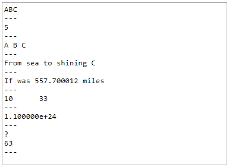
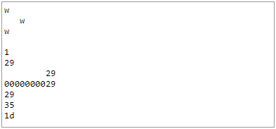
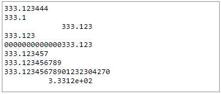
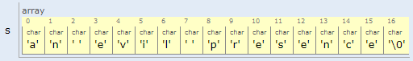
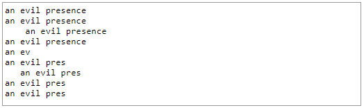
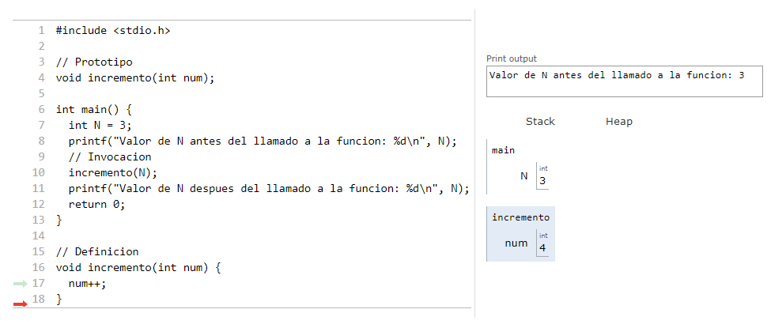
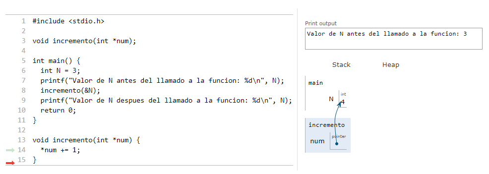

# Introducción al lenguaje C

> **Objetivos**
> * Conocer las generalidades del lenguaje de programación C.
> * Conocer la estructura de un programa en C.
> * Introducir el uso de las funciones y establecer cómo se realiza el paso de parámetros a funciones.

## 1. Formato típico de un programa en C
En su forma más básica un programa en C tiene la siguiente estructura:

```C
/** Directivas del preprocesador */
// Librerías 
#include <libreriaSistema>
#include "libreriaUsuario"

// Macros y constantes con define
#define CTE VALOR_CTE

/* Variables globales*/
tipo1 varG1_1, varG2_1, ...;
tipo2 varG1_2, varG2_2, ...;
...

/* Función principal (Primera en ser llamada)*/
int main(int argc, char *argv[]) {
  /** Variables locales */
  tipo1 varL1_1, varL2_1, ...;
  tipo2 varL1_2, varL2_2, ...;
  ...
  /** Instrucciones */
  ...
  código
  ...
  return 0;
}
```
Como se puede notar, la forma es similar a la que se emplea en cualquier otro lenguaje. A continuación se muestra, con un breve ejemplo un caso de aplicación de la plantilla anterior.

#### Ejemplo:
Hacer un programa que despliegue **Hello world** en pantalla:
1. Empleando java.
2. Empleando C

**Solución**
1. **Empleando java**: a continuación se muestra el código solución en java:

```java
public class Hello {
    public static void main(String[] args) {
      System.out.println("Hello world");
    }
}
```
En [Solución java](https://goo.gl/kKWUEg) se encuentra el código anterior online anteriormente mostrado.

2. **Empleando C**: en el enlace [solución en C](https://goo.gl/9CKdbC) se encuentra el código C que implementa lo solicitado:
```C
#include <stdio.h>

int main(int argc, char *argv[])
{
  printf("%s","Hello, World");
  return 0;
}

```
A modo de repaso, se muestran los comandos empleados para compilar y ejecutar el programa en C:
```
[user@cluster test4]$ gcc -Wall hello.c -o hello.out
[user@cluster test4]$ ls
hello.c  hello.out
[user@cluster test4]$ ./hello.out
Hello, World
```
## 2. Tipos de Datos
Los tipos de datos básicos incorporados en C son los enteros, los reales y los tipo carácter. En la siguiente tabla se resumen éstos:

**Tabla 1**. Tipos de datos primitivos en C

| Tipo de dato                                | Tamaño (en bytes) | Rango                     | Especificador de formato |
|---------------------------------------------|-------------------|---------------------------|--------------------------|
| short (short int)                           | 2                 | -32768 to 32767           | %hd                      |
| unsigned short (unsigned short int)         | 2                 | 0 to 65535                | %hu                      |
| unsigned (unsigned int)                     | 4                 | 0 to 4294967295           | %u                       |
| int                                         | 4                 | 2147483648 to 2147483647  | %d                       |
| long (long int)                             | 4                 | 2147483648 to 2147483647  | %ld                      |
| unsigned long (unsigned long int)           | 4                 | 0 to 4294967295           | %lu                      |
| long long (long long int)                   | 8                 | -(2^63) to (2^63)-1       | %lld                     |
| unsigned long long (unsigned long long int) | 8                 | 0 to 18446744073709551615 | %llu                     |
| char (signed char)                          | 1                 | -128 to 127               | %c                       |
| unsigned char                               | 1                 | 0 to 255                  | %c                       |
| float                                       | 4                 |                           | %f                       |
| double                                      | 8                 |                           | %lf                      |
| long double                                 | 12                |                           | %Lf                      |


El manejo de los tipos de datos en C es muy similar al que se hace en java. Cabe resaltar que de los tipos de datos enteros, el tipo **char** se utiliza para representar caracteres de modo que las constantes tipo **char** pueden ser:
1. Caracteres encerrados entre comillas ('A', 'b', 'p') asociados a un valor ascii.
2. Caracteres no imprimibles (tabulación, avance de página) los cuales se representan con secuencias de escape ('\n', '\t'). La siguiente tabla muestra algunos de estos caracteres:

**Tabla 2**. Secuencias de escape en C

| Carácter de escape                               | Singnificado | Código ASCII                     |
|---------------------------------------------|-------------------|---------------------------|
| \a                          | Carácter de alerta (timbre)                | 7           |
| \b                          | Retroceso de espacio                | 8           |
| \f                         | Avance de página               | 12           |
| \n                          | Nueva línea                | 10           |
| \r                          | Retorno de carro                | 13           |
| \t                          | Tabulación horizontal                | 9           |
| \v                          | Tabulación vertical                | 11           |
| \\                          | Backslash ( \ ).              | 92           |
| \?                          | Interrogación ( ? ).              | 63           |
| \'                          | Comilla sencilla ( ' ).              | 39           |
| \"                          | Comillas dobles.              | 34           |
| \0nn                          | Número octal.              |            |
| \Xnn                          | Número hexadecimal              |            |
| \0                          | Carácter nulo o terminación de cadena              |           |


La equivalencia entre un carácter específico y su valor ascii se puede encontrar en una tabla ascii como la mostrada en el siguiente [enlace](http://www.fceia.unr.edu.ar/~ifc/apuntes/tascii.pdf).

### 2.1. Variables 
Una declaración indica el tipo de variable y le sirve al compilador para determinar la cantidad de memoria requerida para almacenar la variable deseada. El formato básico para declarar una variable es:
```C
tipo var1, var2, ...;
```

Si la declaración produce también un almacenamiento (inicialización), entonces es una definición.

```C
tipo var = valor inicial;
```

**Nota**: 
* Todas las variables en C se declaran o definen antes de ser utilizadas, de lo contrario el compilador arrojará un error de variable no declarada.
* En esta sección se hace referencia sólo a las variables primitivas (char, int, float, double, et.), cuando las variables son compuestas (arrays, cadenas de caracteres, matrices, ...) la inicializacion es diferente (este tema será abordado más adelante en el curso).

#### Ejemplo:
A continuación se muestran varias declaraciones de variables, note que la forma es similar a la empleada en java:
```C
int i, j, k;
float length, height;
char midinit;
float total = 16.78;
int a = 1, b = 2;
char ac = '@';
const IVA = 19
```
En el siguiente [enlace](https://goo.gl/cgydMU) puede hacer la simulacion del código anterior (note que las variables no inicializadas no aparecen desplegadas).

**Nota**: La palabra reservada **const** (**final** en el caso de java) permite definir determinadas variables con valores constantes que no se pueden modificar.

### 2.2. Cadenas de caracteres
En C una cadena de caracteres (C String) no es un tipo de dato primitivo. En C se requiere usar un **arreglo** de caracteres (datos primitivos tipo char) cada vez que se requiera utilizar un **String**. Existen varias formas de declarar cadenas de caracteres:
1. Indicando el máximo número de carácteres en la definición:
```C
char nombreCadena[TAM];
```
2. Inicializando la cadena de carácteres de modo que el compilador pueda deducir su tamaño:
```C
char nombreCadena[] = "Contenido_de_la_cadena";
```
3. Definiendo el tamaño e inicializando:
```C
char nombreCadena[TAM] = "Contenido_de_la_cadena";
```
En una cadena de carácteres el último carácter útil es el carácter NULL (\0). El cual se incluye de manera automática para marcar el final de la cadena.

#### Ejemplos
1. Declarar una cadena llamada temp de 5 bytes cuyo contenido inicial sea *Hot*:

```C
char temp[5] = "Hot";
```
El resultado en memoria será el siguiente:


| 'H' | 'o' | 't' | '\0' |   |
|-----|-----|-----|------|---|

</center>
Es importante resaltar que el programador debe asegurarse que la cadena de caracteres sea lo bastante grande para el uso deseado. Vemos que **temp** mantiene 4 caracteres, 3 de la palabra *Hot* más el carácter NULL(\0). 

2. Se tienen la siguientes declaraciones:
```C
char s1[6];
char s2[5] = "Hola";
char s3[] = "que mas\n\pues";
```
Responda las siguientes preguntas:
* ¿Cuál es el tamaño de cada una de las cadenas?
* ¿Cuál es el contenido almacenado en cada una?

Si lo ve necesario puede ayudarse del código que se encuentra en siguiente [página](https://goo.gl/R4rprK)

Finalmente, cuando el especificador de formato asociado a una cadena de caracteres es: **%s**, su uso sera explicado posteriormente con mas detalle.

## 3. Entrada y salida estándar
En C la entrada y salida de texto se abstraen como streams o flujos de caracteres, no importa de dónde se origine el flujo o hacia a donde se dirija. Un flujo de texto, es una secuencia de caracteres dividida en líneas; cada línea consiste de cero o más caracteres seguidos por un carácter de nueva línea.

En C las funciones de E/S y  las estructuras de datos usadas por esas funciones se encuentran declaradas en el archivo de cabecera **<stdio.h>**. Para el correcto funcionamiento del código es necesario incluir dicho archivo mediante la directiva del preprocesador **#include**, pues en caso contrario, puede funcionar de forma incorrecta, e incluso, puede llegar a dar errores de compilación.

La biblioteca stdio.h provee un conjunto de funciones para leer y escribir desde la consola. A continuación veremos algunas:

### Funcion printf

La forma de la función se muestra a continuacion:

```C
int printf(const char *format[,argumento,...]);
```
La función ```printf()``` se usa para escribir cualquier tipo de dato a la consola. Se conoce como salida formateada pues convierte, formatea, e imprime sus argumentos ```(arg1, arg2, ...)``` en la salida estándar. Para ello toma el formato establecido por el usuario en el argumento **format** (ver en la tabla 1 la columna **especificador de formato** asociada a cada tipo de dato).
Para informacion adicional puede consultar el siguiente [enlace](http://c.conclase.net/librerias/?ansifun=printf#inicio)

Por ejemplo suponiendo que se tiene el siguiente fragmento de código en C: 

```C
printf("Color %s, Number %d, Float %5.2f\n", "red", 12345, 3.14);
```

La salida en pantalla será:

```
Color red, Number 12345, Float 3.14
```

En el siguiente [enlace](https://goo.gl/3c5mcH) puede comprobar el resultado. Notará que la parte asociada a especificador de formato (parte precedida por % en el primer argumento de la función printf) se reemplaza por el respectivo valor asociado a la variable o constante. Como recordatorio, presentamos en la siguiente tabla los especificadores de formato más comunes:

**Tabla 3**. Especificadores de formato más comunes en C

|Especificador de formato  | Tipo de dato |
|----------------|--------------------------|
| %d                         |int   |
| %c                         |char   |
| %s                         |char[] (cadena de caracteres)   |
| %f                         |float   |
| %lf                         |double   |
| %e                         |float (El resultado se muestra en notación exponencial)   |
| %u                         |unsigned   |
| %o                         |unsigned (el resultado se muestra en formato octal)   |
| %x                         |unsigned (el resultado se muestra en formato hexadecimal)   |

**Ejemplo**:
Dado el siguiente fragmento de código:

```C
printf("ABC");
printf("\n");
printf("---\n");
printf("%d\n",5);
printf("---\n");
printf("%c %c %c\n",'A','B','C');
printf("---\n");
printf("From sea ");
printf("to shining ");
printf("C\n");
printf("---\n");
float leg1 = 200.3, leg2 = 357.4;
printf("If was %f miles\n", leg1 + leg2);
printf("---\n");
int num1 = 10, num2 = 33;
printf("%d\t%d\n", num1, num2);
printf("---\n");
float big = 11e+23;
printf("%e\n", big);
printf("---\n");
printf("%c\n",'?');
printf("%d\n",'?');
printf("---\n");
```
La salida en pantalla se muestra a continuación:



**Figura 1**. Salida en pantalla del código anterior

Puede verificar el resultado consultando el siguiente [enlace](https://goo.gl/MkQe9X)

El comportamiendo del especificador dependerá del tipo de dato tal y como se resume en las siguiente tablas segun el tipo de dato a imprimir.

1. **Datos reales**

**Tabla 3**. Usando especificadores para datos tipo char e int

|Especificador de formato  | Tipo de dato |
|----------------|--------------------------|
| %[alineación][ancho]c | char   |
| %[alineación][ancho]d | int |

La salida formateada permite un mayor control de la apariencia de la salida en pantalla, ya que es posible controlar que tantas columnas serán usadas a la salida del contenido de una variable particular al especificar el ancho del campo.
En lo que respecta a la alineación y para todos los casos cuando el símbolo es un menos (-) la alineación será a la izquierda, por otro lado si no hay símbolo, la alineación será a la derecha. Tambien, si se desea colocar ceros en vez de espacios, se debe colocar un cero (0) antes del campo ancho ancho. Por ejemplo: %04d.

**Ejemplo**:
Examine el siguiente fragmento de código teniendo en cuenta la tabla anterior:
```C
char lett='w';
int i=1,j=29;
printf("%c\n",lett);
printf("%4c\n",lett);
printf("%-3c\n\n",lett);
printf("%d\n",i);
printf("%d\n",j);
printf("%10d\n",j);
printf("%010d\n",j);
printf("%-010d\n",j);
printf("%2o\n",j);
printf("%2x\n",j);
```
Puede verificar el resultado consultando el siguiente [enlace](https://goo.gl/fYDXkX). La siguiente figura muestra el resultado en pantalla:



**Figura 2**. Salida en pantalla del código anterior

2. **Datos reales**

**Tabla 4**. Usando especificadores para datos tipo float (también aplica a los demas tipos de datos reales)

|Especificador de formato  | Tipo de dato | Ejemplo | Resultado |
|----------------|--------------------------|----|---|
| %[alineación][ancho].[decimales]f| float   | printf("%10.4f",4.0/3.0)|_ _ _ _1.3333 |
| %[alineación][ancho].[decimales]e| float   | printf("%10.4e",4.0/3.0)|_1.333e+10|

**Ejemplo**:
Examine el siguiente fragmento de código:

```C
float x=333.123456;
double y=333.1234567890123456;
printf("%f\n",x);
printf("%.1f\n",x);
printf("%20.3f\n",x);
printf("%-20.3f\n",x);
printf("%020.3f\n",x);
printf("%f\n",y);
printf("%.9f\n",y);
printf("%.20f\n",y);
printf("%20.4e\n",y);
```
La salida en pantalla se muestra a continuación y puede ser simulada en el siguiente [enlace](https://goo.gl/qM9AXy):



**Figura 3**. Salida en pantalla del código anterior

3. **Cadenas de caracteres**

|Especificador de formato  | Tipo de dato | Ejemplo | Resultado |
|----------------|--------------------------|----|---|
| %[alineación][ancho].[Máximo_número_de_caracteres_a_imprimir]s| char[]   | printf("%3.4s\n","Sheridan")|Sher|

**Ejemplo**:
Examine el siguiente fragmento de código:

```C
char s[]="an evil presence";
printf("%s\n",s);
printf("%7s\n",s);
printf("%20s\n",s);
printf("%-20s\n",s);
printf("%.5s\n",s);
printf("%.12s\n",s);
printf("%15.12s\n",s);
printf("%-15.12s\n",s);
printf("%3.12s\n",s);
```
La variable asociada a la cadena de caracteres tendrá el siguiente contenido:



**Figura 4**. Cadena de caracteres **s** en memoria.

Adicionalmente, La salida en pantalla será:



**Figura 5**. Salida en pantalla del código anterior

Puede verificar el resultado consultando el siguiente [enlace](https://goo.gl/Z7de6H)

### Funcion scanf

La forma de la función se muestra a continuacion:

```C
int scanf(const char *format[,arg1,arg2...]);
```
La función ```scanf()``` se usa para leer cualquier tipo de dato predefinido desde el teclado, y convertirlo de forma automática al formato interno adecuado.

Esta funcion lee caracteres desde el flujo de entrada estándar, los interpreta según lo especificado en **format**, y los almacena en los argumentos. Cada argumento debe ser la dirección de la variable donde será almacenado el carácter. Retorna el número de ítems (argumentos) de entrada emparejados con éxito (almacenados). Los identificadores de formato para scanf son los mismos que para printf (ver tabla 3).

**Notas importantes**
* Cuando el tipo de dato asociado a la variable es simple (char, int, etc); se antepone el símbolo apersand (&) a la variable, pues con este símbolo se obtiene la dirección en memoria de la variable (estoo será explicado más adelante en el curso), por ejemplo:

En el siguiente [enlace](./code/lab2_p1_example1.c) esta el siguiente código:

```C
#include <stdio.h>

int main() {
  int edad;
  float estatura;
  printf("Digite la edad: ");
  scanf("%d", &edad);
  printf("Digite la estatura (en metros): ");
  scanf("%f", &estatura);
  printf("\n------------------------------------------\n");
  printf("Edad: %d\n",edad);
  printf("Estatura %f\n",estatura);
  return 0;
}
```
Note como el ampersand es usado antepuesto a las variables edad y estatura cuando se emplea la funcion scanf. El programa anterior cuando se ejecuta arroja una salida como la siguiente (para nuestro caso asumimos una edad de 3 años y una estatura de 0.8 m).

```
Digite la edad: 3
Digite la estatura (en metros): 0.8

------------------------------------------
Edad: 3
Estatura 0.800000
```


* Cuando lo que se ingresa es una cadena de caracteres, no es necesario emplear el ampersand (&) pues en C el nombre de una cadena de caracteres se interpreta como una dirección de memoria, por ejemplo:

```C
#include <stdio.h>

int main() {
  char nombre[15]; // Almacena maximo 14 caracteres
  printf("Digite el nombre: ");
  scanf("%s",nombre);
  printf("\nHola: %s\n",nombre);
  return 0;
}
```

Note como en este [código](./code/lab2_p1_example2.c) no se emplea el ampersand cuando se lee la cadena nombre con el scanf (a diferentecia de las variables edad y estatura del ejemplo anterior). La salida del programa anterior se muestra a continuacion:

```
Digite el nombre: Ramon

Hola: Ramon
```

### Ejemplos resueltos de entrada y salida

1. Escriba un programa que use una llamada printf() para imprimir su nombre y su apellido en una línea, use una segunda llamada printf() para imprimir su nombre y su apellido en dos líneas separadas, y use un par de llamadas a printf() para imprimir su nombre y apellido en una línea. La salida del programa podrá ser como esta (pero usando su nombre):

En el siguiente [enlace](./code/lab2_p1_res1.c) se encuentra el código de la solución.

2. Escriba un programa convierta su edad en años a días. En este punto, no se preocupe sobre los años fraccionales y años bisiestos.

En el siguiente [enlace](./code/lab2_p1_res2.c) se encuentra el código de la solución.

3. Escriba un programa que cree una variable entera llamada toes. Luego que haga esto, le lleve 10 a toes. El programa debe calcular el doble y el cuadrado de toes también. El programa imprimirá todos estos tres valores identificándolos.

En el siguiente [enlace](./code/lab2_p1_res3.c) se encuentra el código de la solución.

4. Escriba un programa que solicite un valor en código ASCII, tal como 66, y entonces imprima el carácter asociado a dicho código ASCII.

En el siguiente [enlace](./code/lab2_p1_res4.c) se encuentra el código de la solución.

5. Escriba un programa que lea un número en punto flotante y lo imprima primero en notación de punto decimal y luego en notación exponencial. La salida debe tener el siguiente formato:

En el siguiente [enlace](./code/lab2_p1_res5.c) se encuentra el código de la solución.

// TODO:revisar siguiente enunciado
6. La masa de una molécula única de agua es aproximadamente de gramos. Un cuarto de agua es aproximadamente de 950 gramos. Escriba un programa que solicite la cantidad de agua, en cuartos, y despliegue el número de moléculas en esa cantidad.

En el siguiente [enlace](./code/lab2_p1_res6.c) se encuentra el código de la solución.

7. Escriba un programa que le pregunte por su nombre y apellido y entonces imprima los nombre en formato apellido, nombre.

En el siguiente [enlace](./code/lab2_p1_res7.c) se encuentra el código de la solución.

8. Escriba un programa que solicite su altura en pulgadas y su nombre, y entonces despliegue la información en el siguiente formato:

```
Dabney, you are 6.208 feet tall
```
Es lo que se imprime en caso de que el nombre ingresado sea Dabney y la altura sea 6.298

En el siguiente [enlace](./code/lab2_p1_res8.c) se encuentra el código de la solución.

## 4. Sentencias de Control
Las Instrucciones de control en C son similares a las de Java. A continuación se describe la estructura y se muestan algunos ejemplos:

### 4.1 Estructura condicional 

### 4.1.1. Estructura if/else if/else

La forma de esta estructura se muestra a continuación:

```C
if(condicion1) {
  instrucciones_condicion_1_verdadero;
  ...
}
else if(condicion2) {
  instrucciones_condicion_2_verdadero;
  ...
}
...
else if(condicion_N) {
  instrucciones_condicion_N_verdadero:
  ...
}
else {
  instrucciones_caso_falso;
  ...
}
```
#### Ejemplo
Se tiene la siguiente tabla en la cual se muestra el equivalente entre números y letras para la calificación de notas en una guardería. Realizar un algoritmo en C que tomando como base dicha tabla y como entrada las notas, imprima la nota en letras correspondiente.

| Rango                               | Nota | 
|---------------------------------------------|-------------------|
| nota >= 4.5                          | E              | 
| 4.0 <= nota < 4.5                          | B+              | 
| 3.5 <= nota < 4.0                          | B              | 
| 3.0 <= nota < 3.5                          | B-              | 
| nota < 3                          | I             | 

Una muestra de la salida del programa se muestra a continuación:
```
Introduzca la nota que saco el pelao: 3.2
La nota es: -B
```
A continuación se muestra el [código](./code/lab2_p1_example3.c) de la solución:
```C
#include <stdio.h>

int main() {
  float nota;
  printf("Introduzca la nota que saco el pelao: ");
  scanf("%f",&nota);
  /* Implementacion con if anidados */
  if(nota >= 4.5) {
    // nota >= 4.5 --> E
	printf("La nota es: E\n");
  }
  else if(nota >= 4.0) {
    // nota < 4.5 y nota >= 4.0 --> 4 <= nota < 4.5 --> B+
	printf("La nota es: B+\n");
  }
  else if(nota >= 3.5) {
	// nota < 4.0 y nota >= 3.5 --> 3.5 <= nota < 4 --> B
	printf("La nota es: B\n");
  }
  else if(nota >= 3.0) {
	// nota < 3.5 y nota >= 3.0 --> 3.0 <= nota < 3.5 --> B-
	printf("La nota es: B-\n");
  }
  else {
	// nota < 3.0
	printf("La nota es: I\n");
  }
  return 0;
}
```

A continuacion se muestran dos casos de ejecución y sus respectivas salidas para el programa anterior:
* Introduciendo una nota de 3.6:

```
Introduzca la nota que saco el pelao: 3.6
La nota es: B
```

* Introducciendo una nota de 4.8:

```
Introduzca la nota que saco el pelao: 4.8
La nota es: E
```

### 4.1.2. Estructura switch

La forma de esta estructura se muestra a continuación:

```C
switch(selector) {
  case valor_1:
    instrucciones_1;
    ...
    <break;>
  case valor_2:
    instrucciones_2;
    ...
    <break;>
  case valor_N:
    instrucciones_N;
    ...
    <break;>
  default:
    instrucciones_default;
    ...
}
```
#### Ejemplo
En la siguiente tabla se muestran las categorías a las que pertenecen los signos del zodíaco:

| Rango                               | Nota | 
|---------------------------------------------|-------------------|
| Aries                       | Fuego              | 
| Tauro                          | Tierra              | 
| Géminis                          | Agua              | 
| Cáncer                          | Aire              | 
| Leo                          | Fuego             | 
| Virgo                          | Tierra             | 
| Libra                         | Aire            | 
| Escorpio                          | Agua             | 
| Sagitario                         | Fuego             | 
| Capricornio                         | Tierra             |
| Acuario                         | Aire             |
| Piscis                        | Agua             |

Se quiere escribir un programa en C que:
1. Muestre el listado de los signos del zodiaco.
2. Pida por teclado un número (dato entero) asociado a un signo del zodiaco.
3. Muestre la categoría a la que pertenece el signo del zodiaco seleccionado.

**Nota**: Si el número introducido por el usuario, no está asociado a ningún signo del zodiaco, se mostrará
el mensaje: **"ERROR: <numero> no está asociado a ningún signo"**. Hacer este problema usando la sentencia switch.

A continuación se muestra el [código](./code/lab2_p1_example4.c) de la solución:

```C
#include <stdio.h>

#define ARIES 1
#define TAURO 2
#define GEMINIS 3
#define CANCER 4
#define LEO 5
#define VIRGO 6
#define LIBRA 7
#define ESCORPIO 8
#define SAGITARIO 9
#define CAPRICORNIO 10
#define ACUARIO 11
#define PISCIS 12

int main() {
  int signo;
  printf("SIGNOS DEL ZODIACO\n");
  printf("1. Aries\n");
  printf("2. Tauro\n");
  printf("3. Géminis\n");
  printf("4. Cáncer\n");
  printf("5. Leo\n");
  printf("6. Virgo\n");
  printf("7. Libra\n");
  printf("8. Escorpio\n");
  printf("9. Sagitario\n");
  printf("10. Capricornio\n");
  printf("11. Acuario\n");
  printf("12. Piscis\n\n");
  printf("Seleccione el signo del zodiaco de su preferencia: ");
  scanf("%d",&signo);
  switch(signo) {
	  case ARIES:
	  case LEO:
	  case SAGITARIO:
	    printf("Su signo es categoria fuego\n");
		break;
	  case TAURO:
          case VIRGO:	  
          case CAPRICORNIO:
	    printf("Su signo es categoria tierra\n");
	    break;
	  case GEMINIS:
          case ESCORPIO:	  
	  case PISCIS:
	    printf("Su signo es categoria agua\n");
	    break;
	  case CANCER:
          case LIBRA:	  
	  case ACUARIO:
	    printf("Su signo es categoria aire\n");
	    break;
	  default:
	    printf("\"ERROR\": no está asociado a ningún signo\n");
  }
  return 0;
}
```
A continuación se muestra un caso de test cuando el usuario ingresa un número no válido para un signo:

```

SIGNOS DEL ZODIACO
1. Aries
2. Tauro
3. Géminis
4. Cáncer
5. Leo
6. Virgo
7. Libra
8. Escorpio
9. Sagitario
10. Capricornio
11. Acuario
12. Piscis

Seleccione el signo del zodiaco de su preferencia: 13
"ERROR": no está asociado a ningún signo
```

### 4.2 Estructura repetitiva
### 4.2.1. Estructura for

La forma de esta estructura se muestra a continuación:

```C
for(expresion_inicializacion; expresion_test; expression_modificacion){
  instrucciones;
  ...
}
```
#### Ejemplo
Escriba un programa que sume una secuencia de enteros. Suponga que el primer entero que se lee especifica el número de valores que faltan por introducir. Su programa deberá leer un solo valor por instrucción de entrada. Una secuencia de entrada típica podría ser:

```
5 100 200 300 400 500
```
Donde 5 indica que deben sumarse los siguientes 5 valores. 

El [código](./code/lab2_p1_example5.c) del programa se muestra a continuacion:

```C
#include <stdio.h>

int main() {
  int N;   // Cantidad de numeros
  int num; // Numero a leer
  int i;   // i-esimo numero
  int sum = 0; // Suma de los numeros
  printf("Ingrese la cantidad de numeros a sumar: ");
  scanf("%d",&N);
  for(i = 0; i < N; i++) {
    scanf("%d",&num);
    sum += num;
  }
  printf("\nLa suma es: %d\n",sum);
  return 0;
}
```

A continuación se muestra un caso de ejecución del programa anterior:

```
Ingrese la cantidad de numeros a sumar: 3
123 3 3

La suma es: 129
```
**Nota**: Para el caso, la función ```scanf``` toma el **espacio** como un **enter**. Lo anterior implica que el caso anterior sería similar al que se muestra a continuacion (en lo que respecta a los valores capturados desde el teclado):

```
Ingrese la cantidad de numeros a sumar: 3
123 
3 
3

La suma es: 129
```

### 4.2.2. Estructura while

La forma de esta estructura se muestra a continuación:

```C
while(condicion_control){
  instrucciones;
  ...
}
```
#### Ejemplo
Escriba un programa que calcule e imprima el promedio de varios enteros posivos. Suponga que el último valor leído es el centinela 9999. Una secuencia típica de entrada sería:
```
10 8 11 7 9 9999
```
Que indica que el promedio de todos los valores que preceden a 9999 se va a calcular. (**Pista**: Hacer esto con un ciclo **while** dentro del cual se lean los valores a promediar, siempre y cuando la condición de que lo leído no sea 9999, se cumpla).

La [solución](./code/lab2_p1_example6.c) se muestra a continuación:

```C
#include <stdio.h>

const unsigned CENTINELA = 9999;
int main() {
  int num; // Numero a leer
  int sum = 0; // Suma de los numeros
  scanf("%u",&num);
  while(num != CENTINELA) {
    sum += num;
    scanf("%d",&num);
  }
  printf("\nLa suma es: %d\n", sum);
  return 0;
}
```

Ingresando los valores 10, 8, 11, 7 y 9 se obtiene 45 como resultado de la suma, veamos el programa en acción para este caso:

```
10 8 11 7 9 9999

La suma es: 45
```

### 4.2.3. Estructura do-while

La forma de esta estructura se muestra a continuación:

```C
do {
  instrucciones;
  ...
} while(condicion_control);
```

#### Ejemplo
Hacer un programa que solicite un número de tal manera que si este es negativo mostrara un mensaje que diga "Número negativo asi que suerte", y si es positivo mostrará un mensaje que diga: "Número positivo, siga usted" y solicite nuevamente un número.

La [solución](./code/lab2_p1_example7.c) se muestra a continuación:

```C
#include <stdio.h>

int num; // Numero a leer

int main() {
  
  do {
    scanf("%d",&num); 
    if(num >= 0) {
      printf("Numero positivo, siga usted\n"); 
    }
    else {
      printf("Numero negativo asi que suerte\n"); 
    }
  } while(num >= 0);    
  printf("\nFin del programa\n");
  return 0;
}
```

A continuación se muestra una salida típica al ejecutar el anterior programa:

```
1
Numero positivo, siga usted
2
Numero positivo, siga usted
3
Numero positivo, siga usted
0
Numero positivo, siga usted
-7
Numero negativo asi que suerte

Fin del programa
```

## 5. Funciones

Ademas de las funciones de librerias (como scanf y prinf) en C es posible crear funciones definidas por el usuario haciendo que los programas sean modulares. Una funcion en C es un pequeño **sub-programa** que lleva a cabo una tarea particular. La forma de trabajar con funciones en C sigue la misma filosofia que la empleada en los metodos en java. Para usar funciones el programador debe hacer tres cosas:
1. **Definir** la función.
2. **Declarar** la función.
3. **Usar** la función.

A continuación se detalla cada aspecto de los anteriormente mencionados.
###  1. Definición de la función

Consiste en las instrucciones que implementan lo que hace la función. La definición de una función tiene la siguiente sintaxis:

```C
return_type function_name (data type variable name list) {
  local declarations;
  function statements;
}
```

**Ejemplo**

Hacer una función que calcule el factorial de un número:

```C
int factorial (int n) {
  int i,product=1;
  for (i=2; i<=n; ++i)
    product *= i;
  return product;
}
```
### 2. Declaración de la función
La declaración de una función está asociada a la cabecera de la funcion. El código de la declaración debe ubicarse antes de que la función sea definida. También se conocen como prototipos de la función y no son más que la cabecera de la función. La forma es la siguiente.

```C
return_type function_name (data type variable name list);
}
```

**Ejemplo**
¿Cual es el prototipo de la función factorial del ejemplo anterior?

```C
int factorial (int n);
```
### 3. Uso de la función
Consiste en invocar la funcion; lo cual consiste en colocar el nombre de la función proporsionando los argumentos y variables para almacenar valores retornados (en caso de ser necesario).

**Ejemplo**

* Calcular el factorial de 8 llevando el resultado a una variable llamada f

```C
int f;
f = factorial(8);
```

* Calcular el factorial de un número ingresado por el usuario:

```C
int num, f;
printf("Ingrese el numero");
scanf("%d",&num);
f = factorial(num);
printf("%d! = %d\n", num, f);
```

#### Ejemplo
Los ejemplos anteriormente mostrados solo hacian énfasis en las partes de las funciones. Para usar una funcion es necesario unir los aspectos anteriormente mencionados a la hora de codificar el archivo fuente, vamos a ver varios ejemplos para tal fin. A continuación se muestra el [código](./code/lab2_p1_example8.c) del programa completo:

```C
#include <stdio.h>

/* Declaracion de funciones */
int factorial(int n);

/* Funcion principal */
int main() {
  int num; 
  int fac;
  printf("Digite un numero positivo o -1 para terminar: ");
  scanf("%d", &num);
  while(num != -1) {
	 fac = factorial(num);
     printf("%d! = %d\n\n", num, fac);
     printf("Digite un numero positivo o -1 para terminar: ");
     scanf("%d", &num); 	 
  }
  printf("\nSuerte es que le digo...");
  return 0;
}

/* Definicion de funciones */ 
int factorial(int n) {
  if (n > 0) {
    return n*factorial(n-1);
  }
  else {
    return 1;
  }
}
```

A continuación se muestra un caso de ejecucion del programa anterior:

```
Digite un numero positivo o -1 para terminar: 0
0! = 1

Digite un numero positivo o -1 para terminar: 5
5! = 120

Digite un numero positivo o -1 para terminar: -1

Suerte es que le digo...
```
### Ejemplos resueltos funciones
1. Se define un número combinatorio m sobre n de la siguiente manera:


Escribir un programa que lea los valores de m y de n y calcule el valor de m sobre n.

El código de la solución se encuentra en el siguiente [enlace](./code/lab2_p1_res9.c)

2. Escriba el programa de los signos del zodiaco y su simbolo asociado (agua, aire, tierra y fuego) visto en ejemplos anteriores, pero para este caso modularise el programa empleando funciones:

**Nota**: Se le deja al estudiante.

## 6. Paso de parámetros a una función

En lenguaje C existen dos formas de pasar parametros a una función, estos son:
1. Paso por valor.
2. Paso por referencia.

A continuacion se tratará cada uno de estos con más detalle:

### 6.1. Paso por valor
Cuando un argumento es pasado a una función su valor es copiado en el parámetro de la función. Como la función trabaja sobre el parámetro cuando es invocada, los cambios realizados al parámetro (copia del argumento) de la función no afectan el valor pasado como argumento. La forma típica de una función de este tipo se muestra a continuación:

* **Declaracion o prototipo**

> ```C
> return_type function_name (type1 var1, type2  var2, ...);
> ```

El siguiente código es un ejemplo de lo anterior: 
 
```C
void incremento(int num);
```

* **Definicion**

> ```C
> return_type function_name (type1 var1, type2  var2, ...) {
>   // Intrucciones 
>   ...
>   code...
>   ...
> }
> ```

El siguiente código es un ejemplo de lo anterior: 

```C
void incremento(int num) {
  num++;
}
```

* **Invocacion**
> ```C
> < var_resultado = > function_name (arg1, arg2, ...);
> ```

El siguiente código es un ejemplo de lo anterior: 

```C
int N = 1;
incremento(N);
```

**Ejemplo**
En el siguiente ejemplo se muestra una función que incrementa valor que se pasa al parámetro. Este, como los ejemplos vistos con anterioridad emplean el paso de funciones por argumento:

El código de la solucion se encuentra en el siguiente [enlace](https://goo.gl/ebh6Jg)
```C
#include <stdio.h>

// Prototipo
void incremento(int num);

int main() {
  int N = 3;
  printf("Valor de N antes del llamado a la funcion: %d\n", N);
  // Invocacion
  incremento(N);
  printf("Valor de N despues del llamado a la funcion: %d\n", N);
  return 0;
}

// Definicion
void incremento(int num) {
  num++;
}
```
La siguiente figura muestra un caso de ejecución del codigo anterior:



**Figura 6**. Visualización del programa anterior (**Nota**: éste aún no ha culminado su ejecución).

**Preguntas**
1. ¿Cuál es el valor de num y N antes del retorno de la función incremento? ¿Cambian ambas variables? (Puede ayudarse del enlace solución).

### 6.2. Paso por referencia

Una función por referencia es aquella que emplea como parámetros apuntadores (variables que almacenan direcciones de memoria, este tema se tratará después con más detalle). En este caso particular cuando una función es llamada por referencia lo que se pasa es la dirección de la variable pasada como argumento (anteponiendo el ampersand (**&**) al nombre de esta (**&var** = **Dirección de var**)), con esto, la función no trabaja sobre una copia local del argumento, sino directamente sobre la variable en sí, pues su contenido en memoria es manipulado a través del apuntador asociado al parámetro de la función. A continuación, se muestra la forma básica de trabajo para llamados por referencia:

* **Declaración o prototipo**

> ```C
> return_type function_name (type1 *var1, type2  *var2, ...);
> ```

El siguiente código es un ejemplo de lo anterior: 
 
```C
void incremento(int *num);
```

* **Definición**

> ```C
> return_type function_name (type1 *var1, type2  *var2, ...) {
>   // Intrucciones 
>   ...
>   code...
>   ...
> }
> ```

El siguiente código es un ejemplo de lo anterior: 

```C
void incremento(int *num) {
  *num += 1;
}
```

**Nota**: Tanto en la declaración como en la definición note que el manejo del parametro se hizo anteponiendo a la variable un simbolo asterisco (*****), esto se debe a que el parametro es una variable tipo apuntador, este será un tema posterior, por ahora, tenga en cuenta que gracias al asterisco es que se puede cambiar el contenido almacenado en la memoria de la variable a la que el parametro tipo apuntador num apunta.

* **Invocacion**
> ```C
> < var_resultado = > function_name (&arg1, &arg2, ...);
> ```

El siguiente código es un ejemplo de lo anterior: 

```C
int N = 1;
incremento(&N);
```

**Nota**: Observe que la invocación para el caso se hizo con el operador ampersand (&), esto tiene su razón de ser pero será abordado después, por ahora tenga en cuenta que cuando se pasan variables a funciones y el llamado es por referencia se les debe anteponer el operador ampersand (&) como en el ejemplo anterior y en el caso de la función scanf (analizada previamente).

**Ejemplo**
En el siguiente ejemplo se muestra una función que incrementa referencia que se pasa al parámetro, la idea es resumir todo lo expuesto anteriormente, no se preocupe si de entrada no coje el hilo, es el tema más dificil de manejar en C (incluso, personalmente fue algo difícil de entender en nuestro pregrado), pero una vez tenga claridad con esto todo fluirá.

En el siguiente [enlace](https://goo.gl/5CQ2s7), se encuentra la solución. Observe detenidamente lo que pasa cuando la función es invocada.

```C
#include <stdio.h>

void incremento(int *num);

int main() {
  int N = 3;
  printf("Valor de N antes del llamado a la funcion: %d\n", N);
  incremento(&N);
  printf("Valor de N despues del llamado a la funcion: %d\n", N);
  return 0;
}

void incremento(int *num) {
  *num += 1;
}
```
Para visualizar más fácil lo que se afirmó en los párrafos anteriores observe la siguiente imagen:



**Figura 7**. Visualización del programa anterior (**Nota**: éste aún no ha culminado su ejecución).

**Preguntas**
1. ¿Cuál es el valor de N antes y después del retorno de la función incremento?

**Asimilando lo anterior**
1. Repase los ejemplos anteriormente mostrados y observe las diferencias en su ejecución:
* [Código llamado por valor](https://goo.gl/ebh6Jg)
* [Código llamado por referencia](https://goo.gl/5CQ2s7)

Por comodidad se colocan nuevamente las imágenes de los dos códigos anteriormente involucrados:


**Figura 8**. Visualización del programa anterior (**Nota**: éste aún no ha culminado su ejecución).

2. Analice y entienda el siguiente [código](https://goo.gl/NsuZLC):

```C
#include <stdio.h>

void intercambioReferencia(int *x, int *y);
void intercambioValor(int x, int y);

int main() {
    int x = 5, y = 10;
    printf("---------------------------------------------------\n");
    printf("Llamada por valor\n");
    printf("Antes del intercambio: x = %d; y = %d\n", x , y);    
    intercambioValor(x, y);
    printf("Despues del intercambio: x = %d; y = %d\n", x , y);
    printf("---------------------------------------------------\n");
    printf("Llamada por referencia\n");
    printf("Antes del intercambio: x = %d; y = %d\n", x , y);    
    intercambioReferencia(&x, &y);
    printf("Despues del intercambio: x = %d; y = %d\n", x , y);
    printf("---------------------------------------------------\n");
    return 0;
}

void intercambioReferencia(int *px, int *py) {
    int temp;
    temp = *px;
    *px = *py;
    *py = temp;    
}

void intercambioValor(int x, int y) {
    int temp;
    temp = x;
    x = y;
    y = temp;
}
```


## 7. Enlaces de interés
* https://www.geeksforgeeks.org/data-types-in-c/
* https://www.programiz.com/c-programming/c-enumeration


